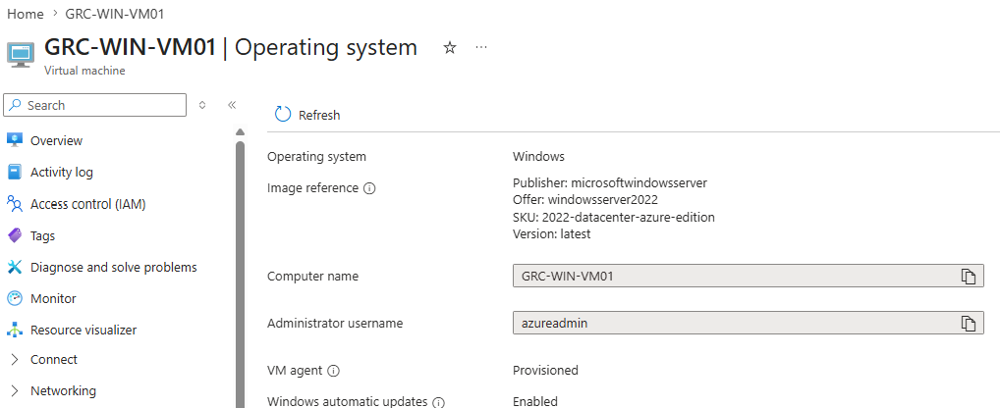
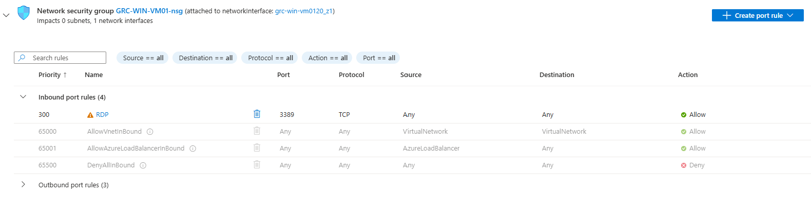
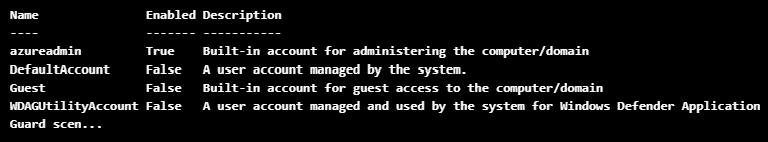
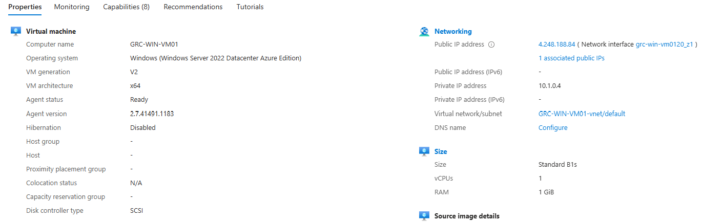
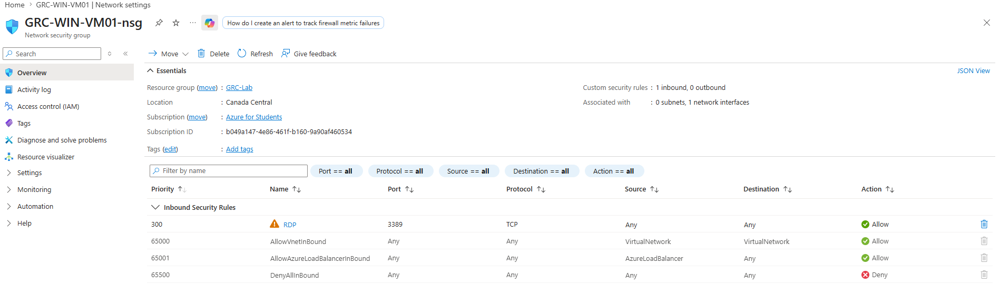

# cloudSec-Risk-Assessment-GRC-Simulation

### Virtual Machine Creation

Created VM `GRC-WIN-VM01`

During the setup I intentionally set the public inbound port to allow RDP (3389)
This exposure will be documented as a security risk later

This VM will act as the entire assessment scope

GRC Steps

## Step 1: Identify Assets “What would hurt if compromised?”

> Confirming the operating system
>
> 

> Identify Externally Acessible Services That Increase Attack Surface
>
> 
>
> Notice that RDP is open

> Identify Privileged Accounts With Elevated Access to The System.
>
> powershell
> ```powershell
> Get-LocalUser
> ```
>
> Output
>
> 
>
> Here we notice that..

> Determine if VM is Accessible From The Internet
>
> 
>
> The VM is assigned a public ip. This is considered High Risk as hackers constantly run automated scripts to scan the internet for open RDP ports.

## Step 2: Identify Threats "What Could Go Wrong?"

# Asset-Specific Threat Scenario Matrix

| Asset | Threat Scenario |
| :--- | :--- |
| **Public RDP** | Internet brute-force attacks |
| **Admin account** | Password compromise |
| **OS** | Exploitation of known vulnerabilities |
| **Azure account** | Unauthorized configuration changes |
| **Logs** | Undetected malicious activity |

## Step 3: Identify Vulnerabilites "Why the Threat Could Work"

> 
>
> The Network Security Group is attached to the netowrk interface and RDP is allowed in the inbound port rules. This increases the risk of brute-force and credential-based attacks.


