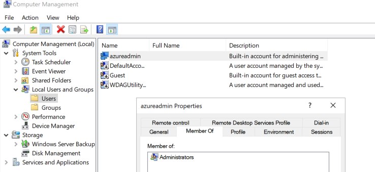
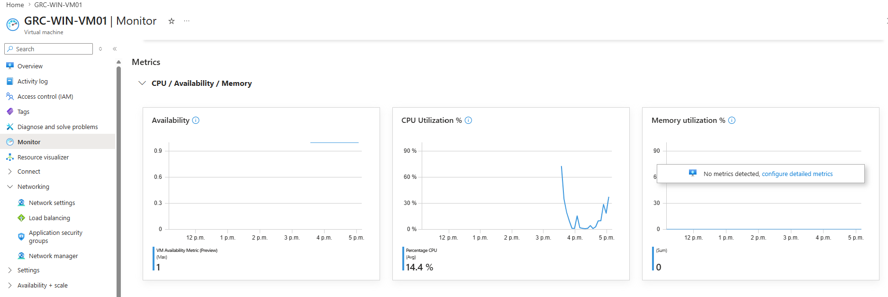
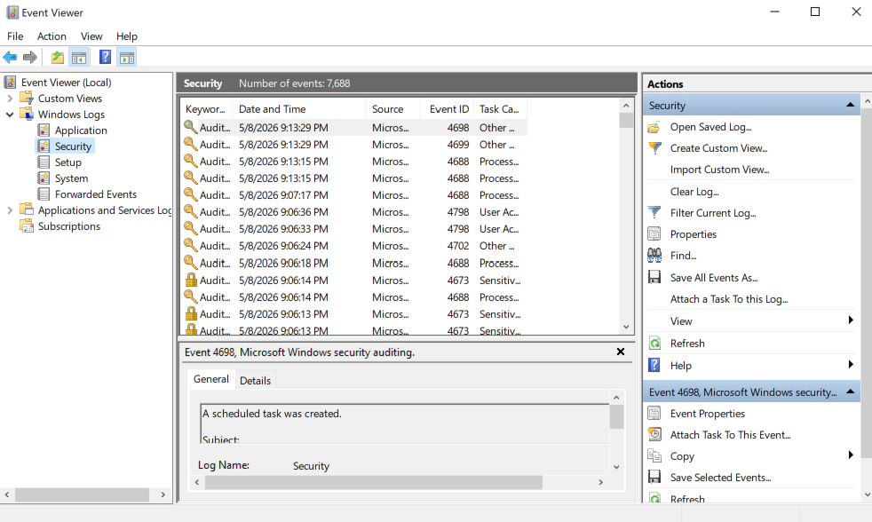

# Cloud Security Risk Assessment & GRC Simulation (Azure)

## Project Objective

The goal of this project was to simulate a professional Governance, Risk, and Compliance (GRC) workflow by performing a risk assessment on an Azure-hosted virtual machine. By intentionally configuring common security gaps—such as exposed RDP ports and disabled multi-factor authentication—the project demonstrates how to identify assets, quantify risks using the NIST SP 800-30 formula, and map technical vulnerabilities to industry-standard frameworks like CIS and NIST CSF.

## Tools and Technologies

- **Microsoft Azure**: Used for cloud infrastructure, including Virtual Machines (VM), Network Security Groups (NSG), and Resource Groups.

- **PowerShell**: Utilized for OS-level auditing to identify privileged local accounts and system configurations.

- **NIST SP 800-30**: Applied as the primary risk assessment framework to calculate likelihood, impact, and overall risk scores.

- **CIS Critical Security Controls**: Used to map technical security controls to industry-recognized defensive strategies.

- **NIST Cybersecurity Framework (CSF)**: Leveraged to align mitigation strategies with official compliance categories like Protect (PR) and Detect (DE).


#### Virtual Machine Creation

Created VM `GRC-WIN-VM01`

During the setup I intentionally set the public inbound port to allow RDP (3389). This exposure will be documented as a security risk later.

This VM will act as the entire assessment scope.

## GRC Steps (Identify Assets, Threats, and Vulnerabilities):

### Step 1: Identify Assets “What would hurt if compromised?”

Confirming the operating system
>
> 

<br>

Identify Externally Acessible Services That Increase Attack Surface
>
> 
>
> Notice that RDP is open

<br>

Identify Privileged Accounts With Elevated Access to The System.

> powershell
> ```powershell
> Get-LocalUser
> ```

Output
>
> 

<br>

Determine if VM is Accessible From The Internet
>
> 
>

_The VM is assigned a public IP. This is considered High Risk as hackers constantly run automated scripts to scan the internet for open RDP ports._

### Step 2: Identify Threats "What Could Go Wrong?"

#### Asset-Specific Threat Scenario Matrix

| Asset | Threat Scenario |
| :--- | :--- |
| **Public RDP** | Internet brute-force attacks |
| **Admin account** | Password compromise |
| **OS** | Exploitation of known vulnerabilities |
| **Azure account** | Unauthorized configuration changes |
| **Logs** | Undetected malicious activity |

### Step 3: Identify Vulnerabilites "Why the Threat Could Work"

> 
>

_The Network Security Group is attached to the network interface and RDP is allowed in the inbound port rules. This increases the risk of brute-force and credential-based attacks._

##### OS-Level Confirmation: 
We need to confirm admin account exits and is a member of the Administrators group.

> 

##### Confirm monitoring is enabled for both Azure and OS-level:

> Azure Monitoring
>
> 
>
> Monitoring is enabled as metrics and basic performance data are visible

<br>

> OS-Level Logging
>
> 
>
> Logs are being generated

We Assume Default OS Configuration Unless Hardened.

#### Identified Vulnerabilities & Impact
*Technical gaps identified during the initial system audit and their potential business impact.*

| Asset | Vulnerability | Why It Matters |
| :--- | :--- | :--- |
| **Virtual Machine (VM)** | RDP exposed to the internet | Increases attack surface |
| **Authentication** | No MFA | Password compromise risk |
| **Operating System (OS)** | Default hardening | Common exploit target |
| **Monitoring** | No SIEM | Attacks may go unnoticed |
| **Identity** | Single admin | No accountability |


## Assign Risk Scores (Quantifying Risk)

Risk Scoring Method
To quantify the identified risks, the following scoring system was utilized:

* **Likelihood:** 1 (Low) → 5 (High) - How probable it is that the threat will occur?
* **Impact:** 1 (Low) → 5 (High) - The severity of damage if the threat is realized.
* **Risk Score:** Likelihood × Impact

Risk Register (Core GRC Artifact)

This register documents the qualitative risk assessment for the Azure lab environment. Risks are calculated using the **NIST SP 800-30** formula: `Likelihood × Impact = Risk Score`.

| Asset | Threat | Likelihood | Impact | Risk Score | Justification |
| :--- | :--- | :---: | :---: | :---: | :--- |
| **RDP** | Brute-force attack | 4 | 4 | 16 | Public Exposure |
| **Admin** | Credential compromise | 3 | 5 | 15 | Full System Control |
| **OS** | Unpatched vulnerabilities | 3 | 4 | 12 | Common Windows Attack |
| **Azure** | Privilege misuse | 2 | 5 | 10 | High Impact |
| **Logs** | Undetected attack | 3 | 3 | 9 | Delayed Responses |

## Map Controls to Policies & Frameworks

Select a Framework: e.g. NIST CSF, CIS Critical Security Controls, etc.

Control Identification: e.g. preventive, detective, corrective.

### Control Mapping Table

This table maps identified risks to specific security controls and industry-standard frameworks (CIS and NIST CSF), demonstrating a structured approach to risk mitigation.

| Risk | Security Control | Control Type | Framework |
| :--- | :--- | :--- | :--- |
| **RDP attacks** | Restrict IP access | Preventive | CIS 4 |
| **Credential theft** | MFA enforcement | Preventive | NIST PR.AC |
| **OS exploits** | Patch management | Corrective | CIS 7 |
| **No detection** | Centralized logging | Detective | NIST DE.CM |
| **Privilege misuse** | RBAC | Preventive | CIS 5 |

Explanation:

* RDP attacks are mitigated by restricting inbound traffic to trusted IPs (CIS 4; Preventive) to mitigate brute-force attacks.

* Credential theft is addressed through Multi-Factor Authentication (NIST PR.AC; Preventive).

* Operating system exploits are reduced through patch management (CIS 7; Corrective) to remediate vulnerabilities.

* Lack of visibility/detection is mitigated by centralized logging (NIST DE.CM; Detective) to address visibility gaps.

* Privilege misuse is controlled through Role-Based Access Control (CIS 5; Preventive) to enforce least privilege and prevent privilege misuse.

## GRC Risk Assessment Report

Check out the report `Risk-Assessment-Report.md`

# Lessons Learned

- **Risk Quantification**: Gained experience in translating technical vulnerabilities (like an open port) into business risk scores using standard probability and impact formulas.

- **Framework Alignment**: Learned how to bridge the gap between technical settings and compliance by mapping security controls directly to CIS and NIST standards.

- **Defense-in-Depth**: Understood the necessity of layered security, realizing that a single preventive control (like an NSG) is more effective when paired with detective controls (like logging).

- **Attacker Perspective**: Observed how default cloud configurations and administrative "short-cuts" create significant attack surfaces that are easily exploitable by automated scripts.

- **GRC Documentation**: Developed the ability to communicate technical findings to stakeholders through professional artifacts like a Risk Register and Control Mapping Table.

# Contact & Links

- LinkedIn: www.linkedin.com/in/zenithsaw

- GitHub: https://github.com/ZenithSaw12
